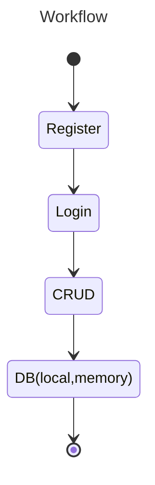
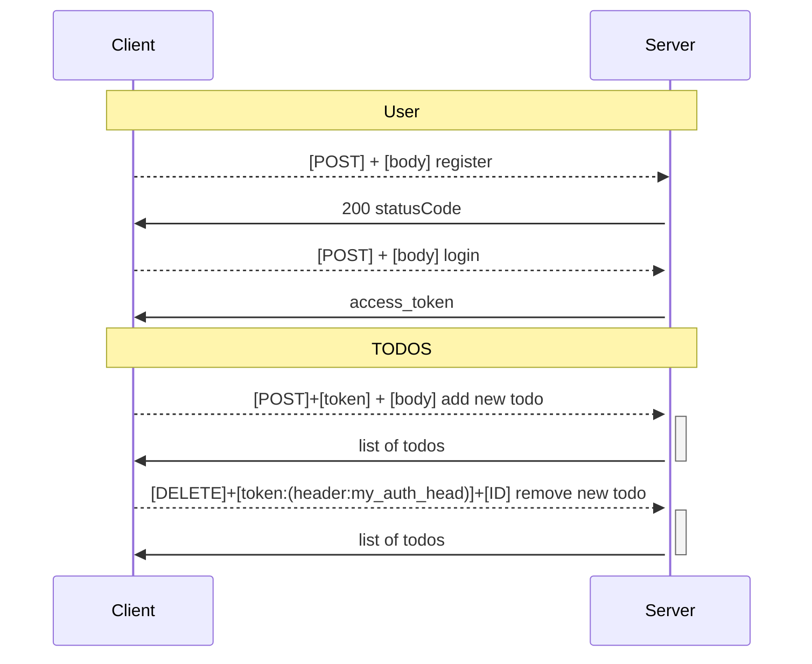

## Description






## Installation

```bash
$ yarn install
```

## Running the app

```bash
# development
$ yarn start

# watch mode
$ yarn start:dev

# build
$ yarn build

# production mode
$ yarn start:prod
```

```curl
$ # GET /profile
$ curl http://localhost:3000/users/profile
$ # result -> {"statusCode":401,"message":"Unauthorized"}

$ # POST /auth/login
$ curl -X POST http://localhost:3000/auth/login -d '{"username": "john", "password": "changeme"}' -H "Content-Type: application/json"
$ # result -> {"access_token":"eyJhbGciOiJIUzI1NiIsInR5cCI6IkpXVCJ9.eyJ1c2Vybm... }

$ # GET /profile using access_token returned from previous step as bearer code
$ curl http://localhost:3000/users/profile -H "my-token: Bearer eyJhbGciOiJIUzI1NiIsInR5cCI6IkpXVCJ9.eyJ1c2Vybm..."
$ # result -> {"userId":1,"username":"john"}
```
# Todo List Controller

This controller provides RESTful endpoints for creating, retrieving, updating, and deleting to-do lists for users. It requires authentication to use the endpoints.

## Endpoints

### GET /todo-list

Description: Retrieves the to-do list for the authenticated user.

Authentication: Yes

Parameters: None

Responses: Returns an array of Todo objects.

### POST /todo-list/add

Description: Creates a new to-do item for the authenticated user.

Authentication: Yes

Parameters: Task object

Responses: Returns an array of Todo objects.

### DELETE /todo-list/one/:id

Description: Deletes a to-do item from the authenticated user's list.

Authentication: Yes

Parameters: ID of the to-do item

Responses: Returns an array of Todo objects.

### PUT /todo-list/one/:id

Description: Updates an existing to-do item for the authenticated user.

Authentication: Yes

Parameters: ID of the to-do item and Task object

Responses: Returns an array of Todo objects.

### GET /todo-list/one/:id

Description: Retrieves a to-do item from the authenticated user's list.

Authentication: Yes

Parameters: ID of the to-do item

Responses: Returns an array of Todo objects.

### POST /todo-list/toggle/one/:id

Description: Toggles a to-do item for the authenticated user.

Authentication: Yes

Parameters: ID of the to-do item

Responses: Returns an array of Todo objects.

# Users Controller

This controller provides RESTful endpoints for user authentication, registration, and retrieving profile information. It requires authentication to use the profile endpoint.

## Endpoints

### POST /users/auth/login

Description: Logs in the user with the given credentials.

Authentication: No

Parameters: AuthDto object

Responses: Returns a JwtPayload.

### POST /users/auth/register

Description: Registers a new user.

Authentication: No

Parameters: AuthDto object

Responses: Returns a 201 and a success message if successful or a 400 and an error message if unsuccessful.

### GET /users/profile

Description: Retrieves the profile information for the authenticated user.

Authentication: Yes

Parameters: None

Responses: Returns a PublicUser object.